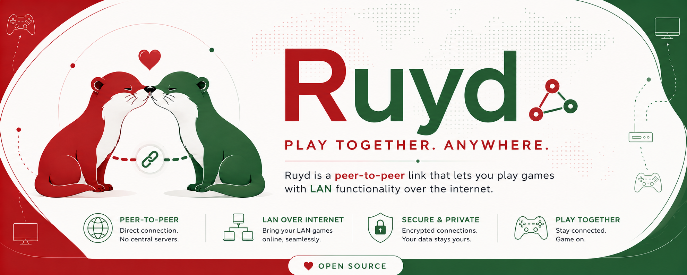

# Ruyd

Ruyd is a small, tray-first app for encrypted direct chat with friends. One person chooses **Host**, shares a connection code, and everyone else chooses **Connect**. Ruyd uses a lightweight public service to introduce the players, then sends chat traffic directly between them.

The current release is an early Windows connectivity MVP. It does **not yet provide voice chat or create a virtual LAN for games**.

## Download the latest Windows release

[**Download the latest versioned Windows release**](https://github.com/shereford/ruyd/releases/latest)

Download either the `.exe` installer or the `.msi` package. `SHA256SUMS.txt` contains the published file hashes. Release assets also include GitHub build-provenance attestations that can be checked with `gh release verify`.

Development releases are not currently Authenticode-signed, so Windows may display a SmartScreen warning. Review the repository, checksums, provenance, and build workflow before installing an unsigned build.

## Documentation

| Link | Description |
| --- | --- |
| [User guide](docs/USER_GUIDE.md) | Installation, hosting, connecting, tray behavior, same-LAN use, privacy, and troubleshooting |
| [Architecture](docs/ARCHITECTURE.md) | Signaling, STUN, WebRTC, security boundaries, availability, and the future virtual-LAN design |
| [Game guides](docs/games/README.md) | Community game-guide index, verification statuses, and guide contribution process |
| [Development](docs/DEVELOPMENT.md) | Development requirements, local commands, alternate signaling configuration, and Windows builds |
| [Contributing](CONTRIBUTING.md) | How to contribute code, documentation, testing reports, and game-specific guides |
| [Request a game guide](https://github.com/shereford/ruyd/issues/new?template=game-guide-request.yml) | Ask the community to research and document a LAN-capable game |

**Game-guide contributors wanted:** Ruyd 0.2 does not carry game traffic yet, so current research must be labeled **Draft**. The first virtual-LAN release will need verified instructions for individual games, editions, and launchers. Start with the [game-guide template](docs/games/GUIDE_TEMPLATE.md).

## Current release

- Direct encrypted WebRTC chat across local or separate networks
- Public signaling and STUN path discovery with no router port forwarding
- Multiple participants, peer list, Windows tray operation, and close-to-background hosting
- Same-LAN chat requires internet access for room signaling; offline-LAN rooms are not supported
- No TURN relay fallback or automatic rejoin after a failed connection
- No voice, file transfer, virtual adapter, game traffic, or LAN broadcast forwarding yet
- No default route or interference with web browsing, Discord, or unrelated applications

Version 2 connection strings are not compatible with the earlier `RUYD1` TCP prototype. Hosts and friends should run the same current release. See the [user guide](docs/USER_GUIDE.md) for complete instructions and limitations.

## Roadmap

- Add automatic reconnect, ICE restart, connection health, and session recovery
- Add optional authenticated TURN relay access for networks where direct paths fail
- Add peer-to-peer voice channels, device selection, mute, and push-to-talk
- Add a narrowly routed virtual LAN transport and allow-listed game discovery forwarding
- Add native **macOS** support
- Add native **Linux support for Debian-based distributions**, including Debian and Ubuntu
- Add optional automatic updates and Authenticode signing

## License

Ruyd is available under the [MIT License](LICENSE).
